<!--
   CPU · Lesson 0 · Session 04 — How do I build things?
   VS Code + Terminal + Git/GitHub for CS freshmen.
   Order: the need -> terminal -> VS Code -> Git/GitHub -> Markdown.
   Every tool section opens with a scene page (quote + keyword beats) before teaching.
   Slides carry keywords only; the HTML comment on each page is the talk track.
-->

<!-- _class: lead -->
<!-- Cover: title in the yellow band, subtitle, then who and when. -->

# How do I build things?

## VS Code · Terminal · Git & GitHub — your first toolchain

Lesson 0 · Session 04 — CPU Tech Group

7 October 2026

### LESSON 0

#### TOOLCHAINS

---

<!-- _class: agenda -->
<!-- Agenda: six stops, first row highlighted. -->

## The plan for today

1. The need - *week one, in five scenes*
2. Terminal - *the fifty-year-old interface*
3. VS Code - *where you write code*
4. Git & GitHub - *keep and share*
5. Markdown & more toolchains - *how it fits together*

---

<!-- _class: yellow -->
<!-- Section divider. -->

## THE NEED

### 01

#### Here comes some TODOs

Lesson 0 · The toolchain — CPU Tech Group

---

<!-- Regular content: five scenarios as a staircase. Enlarged on purpose.
     讲稿：开学第一周的五个场景，一层层递进——写程序、跑起来、交上去、
     组队、读别人的代码。都不是天才问题，是工具和习惯问题。 -->

## 01 · Week one, in five scenes

<br/>

<style scoped>
section { font-size: 45px; }
section ul li { margin: 16px 0 !important; }
section ul ul li { margin: 10px 0 !important; }
section ul li::before {
  width: 15px !important;
  height: 15px !important;
  background: var(--yellow) !important;
}
</style>

- **Write a program** — tip calculator · due Friday
   - **Make it run** — on the grader's machine too
      - **Hand it in** — Moodle zip · later, a Git repo
         - **Team project** — four people · one codebase
            - **Read code** — tutorials → research

---

<!-- _class: yellow -->
<!-- Section divider. -->

## TERMINAL

### 02

#### Where it all began

Lesson 0 · The toolchain — CPU Tech Group

---

<!-- Regular content: the scene that motivates the terminal.
     讲稿：周五要交的作业，spec 里一行小字：代码必须能在实验室服务器上跑。
     你登上去——没有桌面、没有图标，鼠标点哪儿都没反应。
     只有一个黑窗口和一个闪烁的光标，它在等你敲一行字。
     讲完这页闪回 1969：这个黑窗口是从哪来的。 -->

## 02 · The scene — first Friday, 21:47

<style scoped>
section {
  padding-right: 676px;
}
.side-shot {
  position: absolute;
  top: 0;
  right: 0;
  width: 640px;
  height: 720px;
}
.side-shot img {
  width: 100%;
  height: 100%;
  object-fit: contain;
  display: block;
}
</style>

> **"your code must run on the lab server"** — coursework spec, week 1

- **You log in** — no desktop · no icons
- **One black window** · **The mouse does nothing** · a blinking cursor
- **It waits for a line from you**

*Where did this thing come from? 1969.*

<div class="side-shot">
  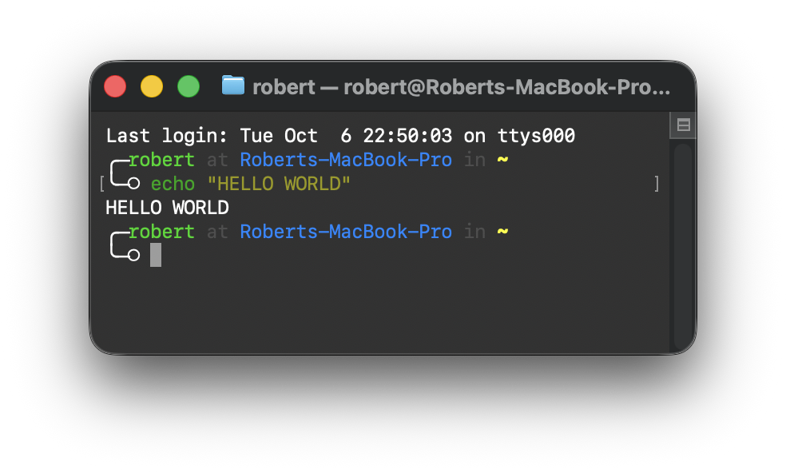
</div>

---

<!-- _class: activities -->
<!-- 讲稿（时间线 1/4 · 1969–1978）：
     1969 年，贝尔实验室。计算机是一整间屋子的 PDP 系列，贵到一整栋楼共用一台。
     工程师排队用一台像打字机的东西跟它说话——电传打字机 teletype（ASR-33）：
     你敲一行，机器在纸上敲一行回给你。Unix 就是在这样的机器上写出来的，
     所以 Unix 的一切从出生起就是"命令"。
     1977/78 年：Bourne shell（真正读你每一行字的程序）登场；
     DEC 的 VT100 把纸换成了屏幕——玻璃终端，"黑窗口"的原形，
     你 Mac 里的 Terminal.app 就是在软件里模拟这台屏幕。 -->

## 02 · Fifty years, one window — 1969–1978

<style scoped>
section.activities {
  font-size: 30px;
  padding-right: 450px;
}
section.activities h2 { font-size: 36px !important; }
section.activities h3 { font-size: 34px !important; margin: 14px 0 6px !important; }
section.activities ul li { font-size: 30px; margin: 4px 0 !important; }
section.activities ul li::before { width: 16px; height: 16px; top: 0.6em; }
.teletype-shot {
  position: absolute;
  top: -350px;
  right: -500px;
  width: 920px;
  height: 1440px;
}
.teletype-shot img {
  width: 100%;
  height: 100%;
  object-fit: contain;
  display: block;
}
</style>

<div class="teletype-shot">
  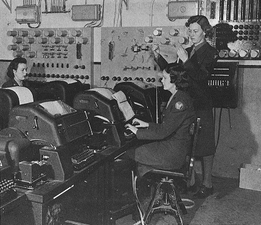
</div>

### 1969 · THE TELETYPE

- **Teletype** — keyboard + paper
- **One room-sized machine** — many users
- **Unix is born here** — everything is a command

### 1978 · THE GLASS TERMINAL

- **VT100** — paper becomes a screen
- **Shell** — 1977 · the program reading your lines
- **Terminal.app** — this screen, emulated

---

<!-- _class: activities -->
<!-- 讲稿（时间线 2/4 · 1981–1984）：
     1981 年另一条支线汇进来：IBM PC 出厂直接进 DOS 的 C:\> 提示符，
     没有桌面没有图标，开机就是命令行（COMMAND.COM 就是那时的 shell）。
     1984 年 Macintosh 把图形界面带进千家万户，点鼠标赢了大众。 -->

## 02 · Fifty years, one window — 1981–1984

<style scoped>
section.activities { font-size: 30px; }
section.activities h2 { font-size: 36px !important; margin-bottom: 6px !important; }
section.activities h3 { font-size: 34px !important; margin: 10px 0 5px !important; }
section.activities ul li { font-size: 30px; margin: 3px 0 !important; }
section.activities ul li::before { width: 16px; height: 16px; top: 0.6em; }
.dos-band {
  position: absolute;
  left: 0;
  right: 0;
  bottom: 0;
  height: 210px;
}
.dos-band img {
  width: 100%;
  height: 100%;
  object-fit: cover;
  object-position: top center;
  display: block;
}
</style>

### 1981 · THE PC JOINS IN

- **IBM PC + MS-DOS** — boots straight to `C:\>`
- **COMMAND.COM** — the DOS shell

### 1984 · GUI ARRIVES

- **Macintosh** — windows · icons · mouse
- **Point-and-click wins the home**

<div class="dos-band">
  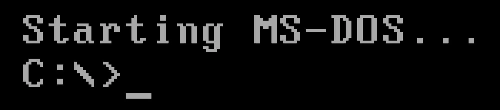
</div>

---

<!-- _class: activities -->
<!-- 讲稿（时间线 3/4 · 1985–2006）：
     1985 年微软回应：Windows 1.0 只是在 DOS 外面套了一层图形壳——
     黑窗口从没消失，只是藏到了界面底下，今天 Win+R 输入 cmd 就能叫出它
     （cmd.exe 就是当年 COMMAND.COM 的后代）。
     2006 年 PowerShell：不再只会处理文本，还能处理对象，运维工程师的挚爱。 -->

## 02 · Fifty years, one window — 1985–2006

<style scoped>
section.activities {
  font-size: 30px;
  padding-right: 580px;
}
section.activities h3 { font-size: 34px !important; margin: 20px 0 8px !important; }
section.activities ul li { font-size: 30px; margin: 9px 0 !important; }
section.activities ul li::before { width: 16px; height: 16px; top: 0.6em; }
.side-shot {
  position: absolute;
  top: 0;
  right: 0;
  width: 538px;
  height: 720px;
}
.side-shot img {
  width: 100%;
  height: 100%;
  object-fit: cover;
  object-position: left center;
  display: block;
}
</style>

### 1985 · WINDOWS ON TOP

- **Windows 1.0** — a GUI riding on DOS
- **The prompt never left** — one `cmd` away

### 2006 · POWERSHELL

- **Objects, not just text**
- **Scriptable everything** — the admin's favourite

<div class="side-shot">
  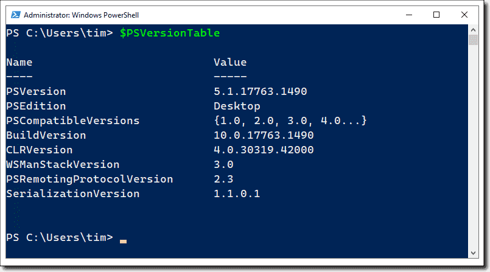
</div>

---

<!-- _class: activities -->
<!-- 讲稿（时间线 4/4 · 2016–今天，收尾）：
     2016 年 WSL——Windows 里跑真正的 Ubuntu 和 bash；
     2019 年 Windows Terminal 带来标签页和主题。
     但注意：图形界面赢了大众，机房依然没有屏幕、凌晨三点的脚本不需要鼠标、
     SSH 连到千里外的服务器只有文字。
     所以无论 Mac 还是 Windows，你今天敲的 ls，和 1969 年工程师敲的是同一个词。 -->

## 02 · Fifty years, one window — 2016–today

<style scoped>
section.activities { font-size: 30px; }
section.activities h3 { font-size: 34px !important; margin: 20px 0 8px !important; }
section.activities ul li { font-size: 30px; margin: 9px 0 !important; }
section.activities ul li::before { width: 16px; height: 16px; top: 0.6em; }
</style>

### 2016–19 · MODERN WINDOWS SHELL

- **WSL** — virtual Ubuntu · real `bash` inside Windows
- **Windows Terminal** — tabs · themes

### TODAY

- **Never left** — servers · scripts · supercomputers
- **Your laptop ships them** — Terminal / PowerShell app · VS Code too

---

<!-- Regular content: two definitions, then why typing survives. -->

## 02 · The black window, in two words

- **Terminal** — the window
- **Shell** — the program inside · zsh · bash · PowerShell
- **Every button is a command** underneath
- **You own several already** — macOS · Windows · VS Code (`` Ctrl + ` ``)
- **Why type?** — chains · scripts · no screen needed

<style scoped>
section {
  padding-right: 476px;
}
section ul li {
  margin: 6px 0 !important;
}
.side-shot {
  position: absolute;
  top: 0;
  right: -200px;
  width: 640px;
  height: 720px;
}
.side-shot img {
  width: 100%;
  height: 100%;
  object-fit: contain;
  display: block;
}
</style>

<div class="side-shot">
  
</div>

---

<!-- Regular content: the right-click menu, reinterpreted. Keywords only.
     讲稿：从你们最熟悉的右键菜单说起——新建、复制、重命名、删除，闭着眼都会点。
     但每个按钮底下，跑的都是一条命令：图形界面 1984 年才来，命令 1969 年就在了。
     菜单是命令的皮肤。接下来五页，把这份菜单翻译回命令。 -->

## 02 · You might be familiar with these

<style scoped>
section {
  padding-right: 676px;
}
.menu-shot {
  position: absolute;
  top: 0;
  right: 0;
  width: 640px;
  height: 720px;
}
.menu-shot img {
  width: 100%;
  height: 100%;
  object-fit: contain;
  display: block;
}
</style>

> **Open Finder / File Explorer**,
> **Right-click**
> ⬇️
> **New**
> ⬇️
> **Folder**
>
> ---
>
> **Copy · Cut (Move) · Delete**

<div class="menu-shot">
  
</div>

---

<!-- Regular content: look around. 讲稿：双击打开文件夹看看有什么——ls；
     双击进去、退出来——cd。两个地址记住：点 = 这里，点点 = 上一级。 -->

## 02 · Look inside — ls · cd

<style scoped>
section {
  padding-right: 676px;
}
.side-shot {
  position: absolute;
  top: 0;
  right: 0;
  width: 640px;
  height: 720px;
}
.side-shot img {
  width: 100%;
  height: 100%;
  object-fit: cover;
  object-position: left center;
  display: block;
}
</style>

- **Open a folder, look** — `ls`
- **Double-click in** — `cd folder`
- **Back out** — `cd ..`
- **`.` = here · `..` = one level up**

*macOS · Linux: identical.*

<div class="side-shot">
  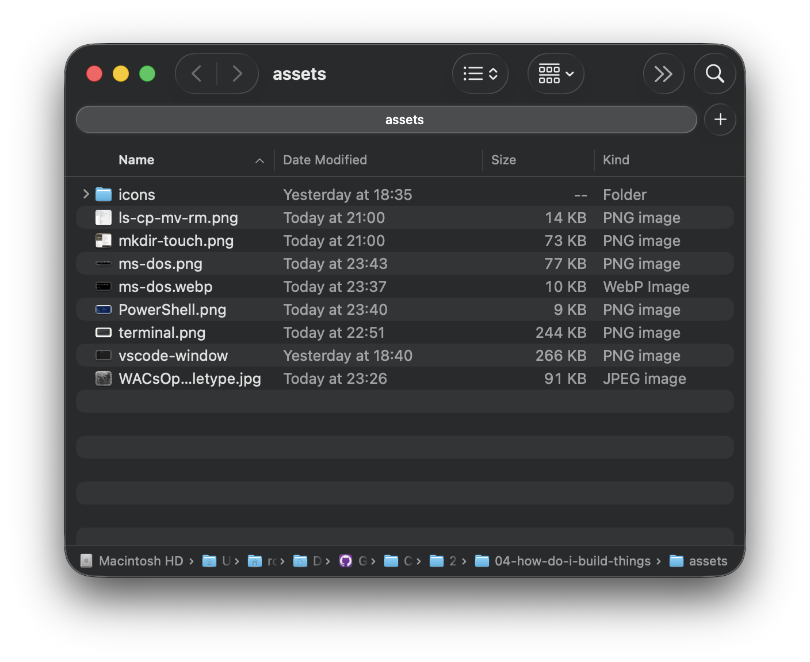
</div>

---

<!-- Regular content: create. Image: the right-click New submenu on the right.
     讲稿：右键新建文件夹，就是 mkdir；新建文本文档，就是 touch——touch 只做一件事，
     放一个零字节的空文件。右边就是你们天天点的菜单：New → Folder、Text Document，
     每个菜单项底下都是一条命令。命令行里"验证"就是再敲一次 ls。 -->

## 02 · New — mkdir · touch

<style scoped>
section {
  padding-right: 676px;
}
.side-shot {
  position: absolute;
  top: 0;
  right: 0;
  width: 640px;
  height: 720px;
}
.side-shot img {
  width: 100%;
  height: 100%;
  object-fit: contain;
  display: block;
}
</style>

- **New → Folder** — `mkdir hello`
- **New → Text Document** — `touch a.txt`
- **touch makes one thing** — an empty file
- **Check it worked** — `ls` again

<div class="side-shot">
  
</div>

---

<!-- Regular content: copy and rename. Image: the ls/cp/mv/rm session.
     讲稿：复制粘贴就是 cp；重命名就是 mv——mv 同时也是移动：给路径就是搬走，给新名字就是改名。
     右边实录：cp a.txt b.txt，mv b.txt c.txt。图里最后一行 rm，留给下一页。 -->

## 02 · Copy, rename — cp · mv

<style scoped>
section {
  padding-right: 676px;
}
.side-shot {
  position: absolute;
  top: 0;
  right: 0;
  width: 640px;
  height: 720px;
}
.side-shot img {
  width: 100%;
  height: 100%;
  object-fit: contain;
  display: block;
}
</style>

- **Copy & Paste** — `cp a.txt b.txt`
- **Rename** — `mv b.txt c.txt`
- **Same command moves** — `mv c.txt archive/`
- **New name = rename · path = move**

<div class="side-shot">
  
</div>

---

<!-- Regular content: delete. 讲稿：删除就是 rm。回看上一页图：最后 rm c.txt，
     再 ls，c.txt 消失了。唯一要敬畏的命令：没有回收站，没有撤销。
     整个文件夹 rm -r project。 freshmen 的第一课：rm 之前先 ls。 -->

## 02 · Delete — rm

<style scoped>
section {
  padding-right: 676px;
}
.side-shot {
  position: absolute;
  top: 0;
  right: 0;
  width: 640px;
  height: 720px;
}
.side-shot img {
  width: 100%;
  height: 100%;
  object-fit: contain;
  display: block;
}
</style>

- **Delete** — `rm c.txt` — gone
- **No Recycle Bin** — no undo, no second chance
- **Whole folders** — `rm -r project`
- **Last line of the picture** — `ls` again: c.txt is gone

*The one command to respect: `ls` before `rm`.*

<div class="side-shot">
  
</div>

---

<!-- Regular content: payoff — the five commands composed into one line. -->

## 02 · One line, one new project

```bash
mkdir my-first-project && cd my-first-project && code .
```

- **Folder → in → open** — zero mouse
- **`.`** — "here"
- **`&&`** — next runs only if the last succeeded
- **The line grows** — `git init` · `git push` soon

---

<!-- Regular content (extension): where terminals will find you this year. -->

## 02 · Where it will find you

- **Installing** — `pip install` · `brew install` · `winget install`
- **Autograders** — coursework runs from one
- **SSH** — lab servers · cloud VMs · no GUI
- **Automation** — 3am, nobody clicking

<!-- ### Linux workshop: 10.11 (this Sunday) 14:00-17:00 @ IAMET 406 -->

---

<!-- _class: yellow -->
<!-- Section divider. -->

## VS CODE

### 03

#### Where the code gets written

Lesson 0 · The toolchain — CPU Tech Group

---

<!-- Regular content: the scene that motivates a real editor.
     讲稿：周二晚上 23:40，第一个 Python 作业。
     记事本里写 hello.py，满屏灰色，括号配不配对全靠自己眼睛；
     第 40 行一个拼写错误，找了半个小时；
     有同学用 Word 写代码，引号被自动换成弯引号，Python 当场报错。
     代码需要的不是打字机，是一个懂代码的工作台。 -->

## 03 · The scene — Tuesday, 23:40

<style scoped>
section {
  padding-right: 476px;
}
.side-shot {
  position: absolute;
  top: 0;
  right: -200px;
  width: 640px;
  height: 720px;
}
.side-shot img {
  width: 100%;
  height: 100%;
  object-fit: cover;
  object-position: center;
  display: block;
}
</style>

> **"implement a tip calculator in Python"**

- **hello.py in Notepad** — all grey · no colours
- **A typo at line 40** — half an hour gone
- **Word curls your quotes** — Python explodes
- **No help is coming**

*Code needs a workshop — not a typewriter.*

<div class="side-shot">
  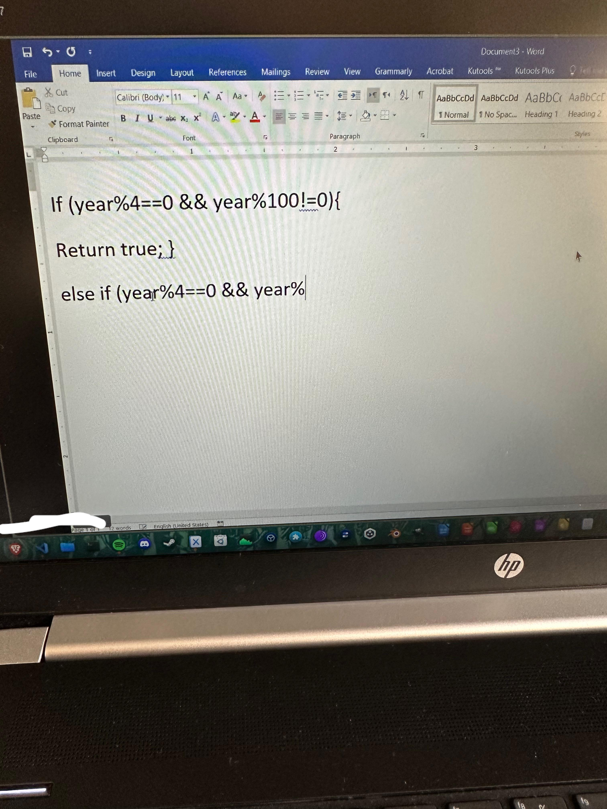
</div>

---

<!-- Regular content: what VS Code is. Icon bottom-right. -->

## 03 · Your workshop for four years

- **Free · everywhere · lightweight** *(itself)*
   - the world's default
- **Bare on purpose**
   - plugins / capabilities arrive as extensions

<style scoped>
section {
  padding-right: 476px;
}
.side-shot {
  position: absolute;
  top: 0;
  right: -150px;
  width: 640px;
  height: 720px;
}
.side-shot img {
  width: 100%;
  height: 100%;
  object-fit: contain;
  display: block;
}
</style>

<div class="side-shot">
  
</div>

---

<!-- Regular content: real VS Code screenshot with numbered overlays and a legend.
     Panel is deliberately legend-only — it is hidden until Ctrl+`. -->

## 03 · One window, multiple areas

<style scoped>
.shot-row {
  display: flex;
  gap: 30px;
  align-items: flex-start;
  margin-top: 6px;
}
.shot-wrap {
  position: relative;
  width: 760px;
  flex: none;
}
.shot-wrap img {
  width: 100%;
  display: block;
  /* border: 3px solid #111111; */
}
.chip {
  position: absolute;
  transform: translate(-50%, -50%);
  width: 48px;
  height: 48px;
  border-radius: 50%;
  background: #f7d447;
  border: 3px solid #111111;
  color: #111111;
  font-weight: 900;
  font-size: 25px;
  display: flex;
  align-items: center;
  justify-content: center;
}
.chip.c1 { left: 2.5%; top: 56%; }
.chip.c2 { left: 13%; top: 38%; }
.chip.c3 { left: 62%; top: 30%; }
.chip.c4 { left: 47%; top: 96%; }
.legend {
  flex: 1;
  height: 475px;
  display: flex;
  flex-direction: column;
  justify-content: space-evenly;
}
.lrow {
  display: flex;
  align-items: baseline;
  gap: 12px;
  margin: 15px 0;
  font-size: 19px;
  line-height: 1.4;
}
.lrow .num {
  flex: none;
  width: 40px;
  height: 40px;
  border-radius: 50%;
  background: #f7d447;
  border: 2.5px solid #111111;
  font-weight: 900;
  font-size: 25px;
  display: flex;
  align-items: center;
  justify-content: center;
  align-self: center;
}
.lrow strong {
  display: block;
  font-size: 30px;
}
.lrow span {
  display: block;
  color: #a3a3a3;
  font-size: 16px;
}
</style>

<div class="shot-row">
  <div class="shot-wrap">
    
    <div class="chip c1">1</div>
    <div class="chip c2">2</div>
    <div class="chip c3">3</div>
    <div class="chip c4">4</div>
  </div>
  <div class="legend">
    <div class="lrow"><div class="num">1</div><div><strong>Activity Bar</strong><span>files · search · git · extensions</span></div></div>
    <div class="lrow"><div class="num">2</div><div><strong>Explorer</strong><span>your project's files</span></div></div>
    <div class="lrow"><div class="num">3</div><div><strong>Editor</strong><span>tabs · code · minimap</span></div></div>
    <div class="lrow"><div class="num">4</div><div><strong>Status Bar</strong><span>branch · Ln/Col · language</span></div></div>
  </div>
</div>

---

<!-- Regular content: language support in three steps, Python first. -->

## 03 · Teaching the editor your language

- **Step 1 — add the language** — Python extension
- **Step 2 — pick the interpreter/compiler** — the status-bar picker
- **Step 3 — Run** — output in the panel below
- **Same pattern forever** — C/C++ · Java · Rust
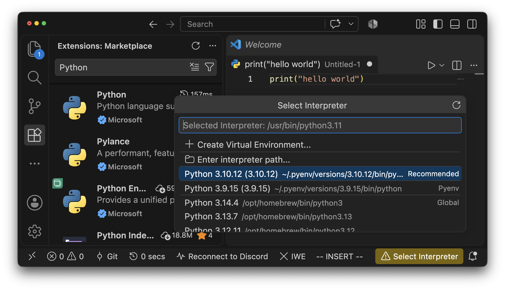

---

<!-- Regular content: a short, opinionated extension list. -->

## 03 · Extensions worth installing today

| Extension | Why |
| --- | --- |
| **Pylance** | intelligent Python language support |
| **Remote - SSH** | connect to remote servers |
| **Prettier** | one format for the team |
| **Error Lens** | see errors in your code |
| **Live Share** | collaborate in real-time |

*Ctrl+Shift+X · all free · can't say why? Uninstall.*

---

<!-- Regular content: the two shortcuts that unlock everything else. -->

## 03 · Two shortcuts and one habit

- **Ctrl/Cmd + Shift + P** — Command Palette — every command
- **Ctrl/Cmd + P** — Quick Open — any file
- **Auto Save: afterDelay** — crashes stop eating homework

*Twice with the mouse this week? It has a shortcut.*

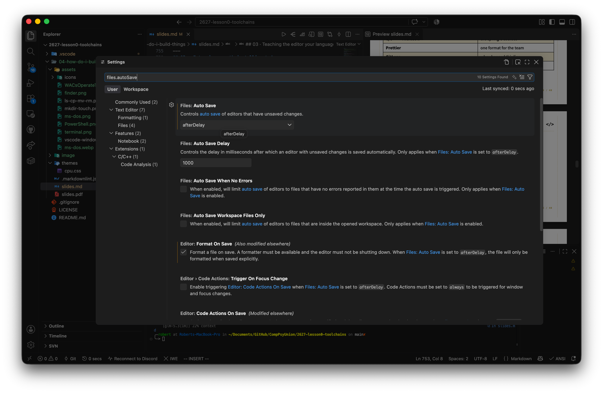

---

<!-- Regular content (extension): other editors exist; depth beats switching. -->

## 03 · Beyond VSCode

- **JetBrains** — PyCharm · IntelliJ · CLion — student licences
- **Vim** — master in terminal
- **Cursor** — AI-first · VS Code base

<style scoped>
section {
  padding-right: 606px;
}
.side-shot {
  position: absolute;
  top: 0;
  right: 0;
  width: 640px;
  height: 720px;
}
.side-shot img {
  width: 100%;
  height: 100%;
  object-fit: contain;
  display: block;
}
</style>

<div class="side-shot">
  
</div>

---

<!-- _class: yellow -->
<!-- Section divider. -->

## GIT & GITHUB

### 04

#### Keep everything, share everything

Lesson 0 · The toolchain — CPU Tech Group

---

<!-- Regular content: the Git scene — pure pain, no tools named yet.
     讲稿：期末论文的文件名进化史，全场都经历过；代码比论文更惨——每天都在改。
     这页只讲痛，不讲任何工具。问全场：你们怎么办？收答案：
     复制文件夹、改后缀、U盘、网盘、微信发给自己——下一页开始逐个拆穿。 -->

## 04 · The scene — a filename horror story

```text
essay.docx -> essay_v2.docx -> essay_final.docx -> essay_final_REAL.docx
```

- **You edit every day** — every day it changes
- **Copies everywhere** — USB · cloud drive · emailed to yourself
- **3am, it breaks** — which one still worked?
- **"final" means nothing**

*There has to be a better way.*

---

<!-- Regular content: the needs map — one staircase, five needs, no commands.
     讲稿：把"版本地狱"拆成五个真实需求，一层层递进：想回到昨天、想看清改了什么、
     电脑坏了也不怕、四个人改一份代码、毕业时能拿出手。
     接下来每个需求两页：先想笨办法为什么不行，再看那条命令怎么解决。
     注意节奏：命令永远最后出场。 -->

## 04 · One folder, five needs

- **Go back** — yesterday's version, please
   - **See what changed** — since it last worked
      - **Survive the laptop** — dies · stolen · left in the library
         - **Work together** — four people · one codebase
            - **Show your work** — the world, eventually

---

<!-- Regular content: need one — go back. Naive attempts fail first, command NOT yet.
     讲稿：需求一：回到昨天。笨办法：整个文件夹复制一份——这就是 essay_v2 的出生方式；
     U盘——三个版本全过期。你真正想要的东西其实有名字：存档点。
     游戏玩家 1990 年就有了，程序员 2005 年才等到。这页不出现任何命令。 -->

## 04 · Need one — "take me back"

> **"it worked yesterday"** — everyone, eventually

- **Copy the folder?** — that's how essay_v2 was born
- **USB drive?** — three versions, all stale
- **What you actually want** — a save point · labelled · kept
- **Games solved this in 1990**

---

<!-- Regular content: the first command, revealed only now.
     讲稿：第一条命令：git commit——打一个存档点，必须写一句诚实的话（commit message），
     比如 "works, before refactor"。git log 列出你打过的所有存档点，时间机器的目录。
     强调：不要求背命令——GitHub Desktop 上那个蓝色大按钮，底下跑的就是它。 -->

## 04 · The command — git commit

- **`git commit`** — take a save point
- **The message** — "works, before refactor" · honest, one line
- **`git log`** — every save point you ever took
- **Never typed by you** — Desktop's blue button, same command underneath

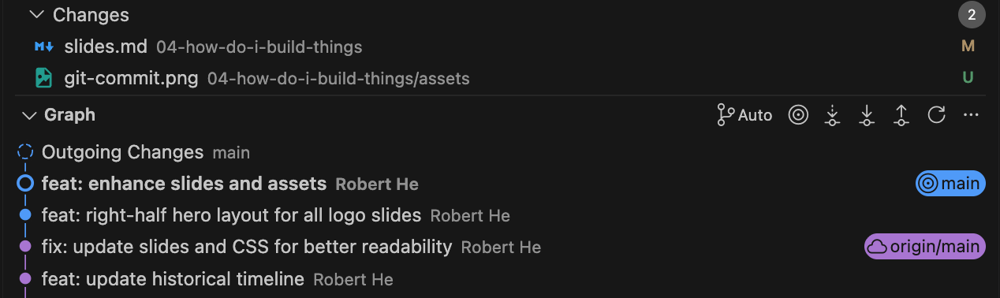

---

<!-- Regular content: need two — what changed. Still no commands.
     讲稿：需求二：刚才还好好的，现在炸了——到底改了什么？
     肉眼扫 400 行不现实；Word 用了一辈子也从没告诉过你两版之间差在哪。
     你想要的是"只给我看不同"。 -->

## 04 · Need two — "what changed?"

> **"it worked five minutes ago"**

- **Scroll and squint?** — 400 lines
- **Microsoft Word** never told you — what moved between two versions
- **You want** — just the differences

---

<!-- Regular content: the second pair of commands.
     讲稿：两条查看命令：git status——哪些文件动了；git diff——具体动了哪几行，红删绿增。
     GitHub Desktop 左侧的文件清单、右侧的行高亮，就是这两条命令的皮肤。
     呼应终端篇的习惯：动手之前先看一眼——ls before rm，status before commit。 -->

## 04 · The commands — git status · git diff

- **`git status`** — which files changed in your workspace
- **`git diff`** — which lines in each file · red gone · green new
- **Desktop shows the same** — file list · line highlights
- **Look before you commit** — same habit as `ls` before `rm`

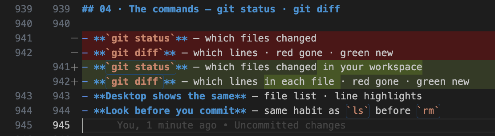

---

<!-- Regular content: need three — the folder must survive the machine.
     讲稿：需求三：电脑会坏、会被偷、会忘在图书馆；你还有宿舍台式机和实验室机器。
     U盘和微信传文件是"版本轮盘赌"。你要的是：这个文件夹在任何机器上都自动是最新的。
     这页同样不出现命令，悬念留给下一页的"云端副本"。 -->

## 04 · Need three — "it's on my other machine"

- **The laptop dies** — or gets stolen · or stays in the library
- **Two computers** — the dorm desktop · the lab
- **USB / WeChat yourself** — version roulette
- **You want** — same folder · everywhere · always current

---

<!-- Regular content: the answer — a cloud copy. The three names arrive only here.
     讲稿：答案：把存档点放到云端一个永远在线的仓库里——GitHub。
     三个名字到这页才出现：Git 是工具（在你电脑上）、GitHub 是网站（云端的家）、
     GitHub Desktop 是方向盘（点按钮不背命令）。push 上传你的存档点，pull 拉下别人的。
     顺带把需求五解决了：这个云端仓库本身就是你的作品集。 -->

## 04 · The answer — a cloud copy

- **Git** — the tool · on your laptop
- **GitHub** — the site · your folder lives in the cloud
- **`git push`** — upload your save points
- **`git pull`** — bring the rest down
- **The driver** — GitHub Desktop · buttons, not typing

---

<!-- Regular content: the mental model as a diagram — recap of everything just learned.
     讲稿：把刚学的三条命令装回一张图：工作文件夹 commit 进本地历史（存档点在你电脑上），
     push 上到 GitHub 云端副本，pull 拉下别人的。四个词就是 Git 的 90%。
     这页是总结页，不是新知识页——大家应该已经在点头了。 -->

## 04 · The loop, in one picture

<style scoped>
.loop {
  display: flex;
  align-items: stretch;
  gap: 26px;
  margin-top: 30px;
}
.zone {
  border: 2.5px dashed #c9b96c;
  padding: 18px 16px 20px;
}
.zone-tag {
  display: inline-block;
  background: #f7d447;
  font-family: ui-monospace, 'SF Mono', Menlo, monospace;
  font-weight: 700;
  font-size: 15px;
  letter-spacing: 0.06em;
  padding: 2px 10px;
  margin-bottom: 12px;
}
.zone.laptop {
  flex: 1.6;
}
.zone.cloud {
  flex: 1;
  display: flex;
  flex-direction: column;
}
.zone.cloud .box {
  flex: 1;
}
.pair {
  display: flex;
  align-items: center;
  gap: 10px;
}
.box {
  background: #ffffff;
  border: 3px solid #111111;
  padding: 10px 14px;
  flex: 1;
}
.box strong {
  display: block;
  font-size: 21px;
  font-weight: 900;
}
.box span {
  display: block;
  color: #a3a3a3;
  font-size: 16px;
  margin-top: 2px;
}
.arrow {
  flex: none;
  font-family: ui-monospace, 'SF Mono', Menlo, monospace;
  font-weight: 700;
  font-size: 16px;
  white-space: nowrap;
}
.link-col {
  display: flex;
  flex-direction: column;
  justify-content: center;
  gap: 14px;
}
</style>

<div class="loop">
  <div class="zone laptop">
    <div class="zone-tag">YOUR LAPTOP</div>
    <div class="pair">
      <div class="box"><strong>Working folder</strong><span>hello.py — where you edit</span></div>
      <div class="arrow">commit →</div>
      <div class="box"><strong>Local history</strong><span>save points kept by Git</span></div>
    </div>
  </div>
  <div class="link-col">
    <div class="arrow">push →</div>
    <div class="arrow">← pull</div>
  </div>
  <div class="zone cloud">
    <div class="zone-tag">GITHUB — CLOUD COPY</div>
    <div class="box"><strong>Remote repository</strong><span>backup · teammates · the world</span></div>
  </div>
</div>

- **commit** — labelled save point, on your laptop
- **push** — upload your save points
- **pull** — download everyone else's

*edit · commit · push · pull — 90% of Git.*

---

<!-- Regular content: GitHub Desktop walkthrough, button by button.
     讲稿：现在把方向盘交出来：克隆（clone，第一次把云端仓库拉到本地）、
     在 VS Code 里改（Desktop 自动列出改动 = git status）、写一句诚实的话点
     Commit to main（= git commit）、Push origin（= git push）。
     鼠标悬停任何按钮，Desktop 会显示底下对应的那条命令——这就是我们装它的原因。 -->

## 04 · GitHub Desktop — the loop, no cmd typing

1. **Clone** — File → Clone repository
2. **Edit in VS Code** — Desktop lists every change
3. **Commit** — tick files · honest message · "Commit to main"
4. **Push origin / Pull origin** — yours up · theirs down

*Hover any button — Desktop shows the git command underneath.*

<style scoped>
.iconstrip {
  display: flex;
  align-items: center;
  justify-content: center;
  gap: 48px;
  margin-top: 44px;
}
.iconstrip .step {
  display: flex;
  flex-direction: column;
  align-items: center;
  gap: 14px;
}
.iconstrip img {
  width: 96px;
  height: 96px;
}
.iconstrip span {
  display: block;
  font-size: 22px;
  font-weight: 700;
  line-height: 1.3;
  text-align: center;
}
.iconstrip span em {
  display: block;
  font-style: normal;
  color: #a3a3a3;
  font-size: 17px;
  font-weight: 500;
  margin-top: 4px;
}
.iconstrip .join {
  font-family: ui-monospace, 'SF Mono', Menlo, monospace;
  font-weight: 700;
  font-size: 34px;
  color: #a3a3a3;
}
</style>

<div class="iconstrip">
  <div class="step">
    
    <span>write<em>your laptop</em></span>
  </div>
  <div class="join">→</div>
  <div class="step">
    
    <span>commit · push<em>GitHub Desktop</em></span>
  </div>
  <div class="join">→</div>
  <div class="step">
    
    <span>see it online<em>github.com</em></span>
  </div>
</div>

---

<!-- Regular content (extension): need four — work together. Branches as parallel timelines.
     讲稿：需求四：四个人一份代码。答案的下半场：分支——每个人的平行时间线，
     main 永远保持能跑，试完了再合并（pull request）。这是第十周的事，先存档这页。 -->

## 04 · Branches — parallel timelines

- **Branch** — a parallel timeline
- **main stays runnable**
- **Teams** — own branch each · merge by pull request
- **In Desktop** — one dropdown: new · switch · merge · publish

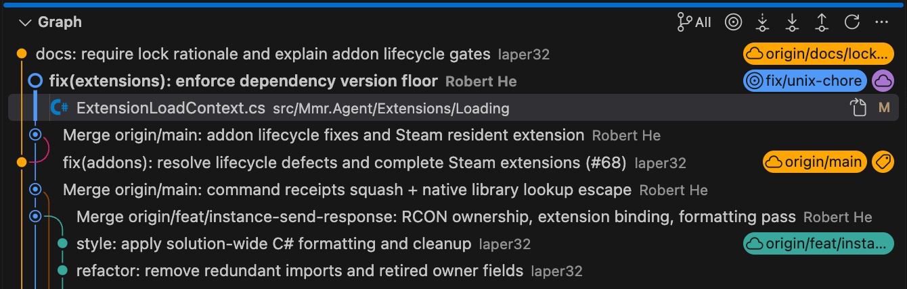

---

<!-- Regular content (extension): need five — show your work. GitHub beyond a backup.
     讲稿：需求五：拿出手。你的 GitHub 主页就是一份活的简历：
     开源协作（issue、pull request、code review）、课程组和科研的可复现代码。
     每个仓库打开第一眼看到的 README——正好引出下一节 Markdown。 -->

## 04 · More than a backup

- **Public workshop** — a profile beats a CV line
- **Open source** — issues · pull requests · reviews
- **Coursework & research** — team repos · reproducible code
- **Every repo opens on its README** — next section

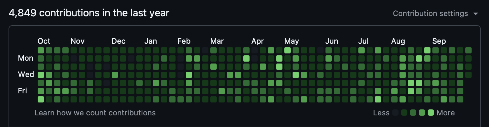

---

<!-- _class: yellow -->
<!-- Section divider. -->

## TOOLCHAIN

### 05

#### Markdown - how it all fits

Lesson 0 · The toolchain — CPU Tech Group

---

<!-- Regular content: the scene that motivates Markdown.
     讲稿：凌晨一点，你随手点开 GitHub 上一个陌生的仓库。
     迎接你的是一个文件：README.md。
     明明是纯文本，却有标题、列表、代码块、链接——
     没用 Word，没有工具栏，只有字符在排版。
     这门"用字符排版"的语言就是 Markdown。 -->

## 05 · The scene — a repo at 1am

> **you open a stranger's repo** — curious, 1am

- **One file greets you** — README.md
- **Plain text** — yet headings · lists · code · links
- **No Word** · no toolbar · no formatting painter
- **Just characters, doing layout**

*That language is Markdown — next.*

---

<!-- Regular content: Markdown overview — source next to its rendered look.
     讲稿：Markdown 的全部哲学：写的时候是纯文本，读的时候是漂亮排版。
     左边是你敲的，右边是读者看的。左边这些符号你都认得吗？
     接下来六页，一个语法一页，全部过一遍。 -->

## 05 · Markdown — write once, read anywhere

<style scoped>
.md-cols {
  display: flex;
  gap: 26px;
  margin-top: 10px;
}
.md-col {
  flex: 1;
  display: flex;
  flex-direction: column;
}
.md-col pre,
.rendered {
  flex: 1;
}
.md-col .tag {
  display: inline-block;
  background: #f7d447;
  font-family: ui-monospace, 'SF Mono', Menlo, monospace;
  font-weight: 700;
  font-size: 15px;
  letter-spacing: 0.06em;
  padding: 2px 10px;
  margin-bottom: 10px;
}
.md-col pre {
  margin: 0;
  background: #f6f1de;
  border: 2.5px solid #111111;
  padding: 14px 18px;
  font-family: ui-monospace, 'SF Mono', Menlo, monospace;
  font-size: 17px;
  line-height: 1.5;
  white-space: pre-wrap;
}
.rendered {
  background: #ffffff;
  border: 2.5px solid #111111;
  padding: 12px 18px 10px;
  min-height: 176px;
}
.rendered .h1 {
  font-weight: 900;
  font-size: 26px;
  line-height: 1.2;
}
.rendered .h2 {
  font-weight: 900;
  font-size: 21px;
  margin-top: 6px;
}
.rendered ul {
  margin: 6px 0;
}
.rendered li {
  margin: 4px 0;
  font-size: 19px;
}
.rendered .lnk {
  color: #7a7a7a;
  text-decoration: underline;
  font-size: 18px;
}
</style>

<div class="md-cols">
  <div class="md-col">
    <div class="tag">YOU TYPE</div>
    <pre># My project
## Setup
- install **Python 3.12**
- run `python hello.py`
- see [the docs](https://...)</pre>
  </div>
  <div class="md-col">
    <div class="tag">READERS SEE</div>
    <div class="rendered">
      <div class="h1">My project</div>
      <div class="h2">Setup</div>
      <ul>
        <li>install <strong>Python 3.12</strong></li>
        <li>run <code>python hello.py</code></li>
        <li>see <span class="lnk">the docs</span></li>
      </ul>
    </div>
  </div>
</div>

- **Plain text, lightly formatted** — readable raw · pretty rendered
- **Everywhere** — GitHub · Jupyter · notes apps
- **This deck** — Markdown, rendered by Marp

---

<!-- Regular content: syntax 1 of 6 — headings.
     讲稿：第一个语法：标题。# 的数量就是级别，一到六级——论文的章、节、小节。
     一个文档只放一个 #（大标题）；README 里章节几乎都是 ## 和 ###。
     两个坑：# 后面要空一格，写 #Project 不算标题；标题上一行要空行。 -->

## 05 · Syntax 1 — headings

<style scoped>
.md-cols { display: flex; gap: 26px; margin-top: 14px; }
.md-col { flex: 1; display: flex; flex-direction: column; }
.md-col pre, .rendered { flex: 1; }
.md-col .tag { display: inline-block; background: #f7d447; font-family: ui-monospace, 'SF Mono', Menlo, monospace; font-weight: 700; font-size: 15px; letter-spacing: 0.06em; padding: 2px 10px; margin-bottom: 10px; }
.md-col pre { margin: 0; background: #f6f1de; border: 2.5px solid #111111; padding: 14px 18px; font-family: ui-monospace, 'SF Mono', Menlo, monospace; font-size: 19px; line-height: 1.55; white-space: pre-wrap; }
.rendered { background: #ffffff; border: 2.5px solid #111111; padding: 14px 18px 12px; min-height: 200px; }
.rh1 { font-weight: 900; font-size: 34px; line-height: 1.2; }
.rh2 { font-weight: 900; font-size: 26px; margin-top: 8px; }
.rh3 { font-weight: 900; font-size: 21px; margin-top: 6px; }
</style>

<div class="md-cols">
  <div class="md-col">
    <div class="tag">YOU TYPE</div>
    <pre># Project
## Setup
### Step 1
#### deeper</pre>
  </div>
  <div class="md-col">
    <div class="tag">READERS SEE</div>
    <div class="rendered">
      <div class="rh1">Project</div>
      <div class="rh2">Setup</div>
      <div class="rh3">Step 1</div>
      <div class="rh3" style="color: #a3a3a3;">…deeper, rarely used</div>
    </div>
  </div>
</div>

- **`#` count = level** — one to six
- **One `#` per document** — the title, like a paper
- **Space after `#`** — `#text` is just text

---

<!-- Regular content: syntax 2 of 6 — emphasis.
     讲稿：第二个语法：强调。**两个星是粗体**，一个星是斜体，三个星都有。
     没有加粗按钮——字符本身就是开关。写邮件签名、划重点、标警告全靠它。
     下划线 _word_ 也行，但星号是通用写法。 -->

## 05 · Syntax 2 — emphasis

<style scoped>
.md-cols { display: flex; gap: 26px; margin-top: 14px; }
.md-col { flex: 1; display: flex; flex-direction: column; }
.md-col pre, .rendered { flex: 1; }
.md-col .tag { display: inline-block; background: #f7d447; font-family: ui-monospace, 'SF Mono', Menlo, monospace; font-weight: 700; font-size: 15px; letter-spacing: 0.06em; padding: 2px 10px; margin-bottom: 10px; }
.md-col pre { margin: 0; background: #f6f1de; border: 2.5px solid #111111; padding: 14px 18px; font-family: ui-monospace, 'SF Mono', Menlo, monospace; font-size: 19px; line-height: 1.55; white-space: pre-wrap; }
.rendered { background: #ffffff; border: 2.5px solid #111111; padding: 16px 18px 12px; min-height: 200px; }
.rendered .row { font-size: 26px; margin: 14px 0; }
.rendered em { font-style: italic; color: #111111; font-size: 1em; font-weight: inherit; }
</style>

<div class="md-cols">
  <div class="md-col">
    <div class="tag">YOU TYPE</div>
    <pre>**important**
*gently*
***both at once***</pre>
  </div>
  <div class="md-col">
    <div class="tag">READERS SEE</div>
    <div class="rendered">
      <div class="row"><strong>important</strong></div>
      <div class="row"><em>gently</em></div>
      <div class="row"><strong><em>both at once</em></strong></div>
    </div>
  </div>
</div>

- **Bold** — `**word**`
- **Italic** — `*word*` · underscores `_` work too
- **No bold button** — the characters are the switch

---

<!-- Regular content: syntax 3 of 6 — lists.
     讲稿：第三个语法：列表。横杠是无序列表，数字加点是有序。
     缩进三格就嵌套一层。最妙的是有序列表的编号是自动的——
     中间插一项，后面的数字全部自己改，永远不会出现 1. 2. 4。 -->

## 05 · Syntax 3 — lists

<style scoped>
.md-cols { display: flex; gap: 26px; margin-top: 14px; }
.md-col { flex: 1; display: flex; flex-direction: column; }
.md-col pre, .rendered { flex: 1; }
.md-col .tag { display: inline-block; background: #f7d447; font-family: ui-monospace, 'SF Mono', Menlo, monospace; font-weight: 700; font-size: 15px; letter-spacing: 0.06em; padding: 2px 10px; margin-bottom: 10px; }
.md-col pre { margin: 0; background: #f6f1de; border: 2.5px solid #111111; padding: 14px 18px; font-family: ui-monospace, 'SF Mono', Menlo, monospace; font-size: 19px; line-height: 1.55; white-space: pre-wrap; }
.rendered { background: #ffffff; border: 2.5px solid #111111; padding: 14px 18px 12px; min-height: 200px; }
.rendered ul { margin: 8px 0; }
.rendered li { font-size: 23px; margin: 6px 0; }
.rendered ol { margin: 10px 0; padding-left: 2em; }
</style>

<div class="md-cols">
  <div class="md-col">
    <div class="tag">YOU TYPE</div>
    <pre>- apples
   - green ones
- pears
   1. clone
   2. commit</pre>
  </div>
  <div class="md-col">
    <div class="tag">READERS SEE</div>
    <div class="rendered">
      <ul>
        <li>apples
          <ul><li>green ones</li></ul>
        </li>
        <li>pears</li>
      </ul>
      <ol>
        <li>clone</li>
        <li>commit</li>
      </ol>
    </div>
  </div>
</div>

- **`-` unordered / `1.` ordered** — that's the whole difference
- **Indent three spaces** — one nesting level
- **Numbers renumber themselves** — insert a step, the rest follow

---

<!-- Regular content: syntax 4 of 6 — code.
     讲稿：第四个语法：代码——你们最常用的一页。一对反引号包行内代码；
     三连反引号开一块代码区，后面写语言名就有语法高亮。
     README 里的安装命令、报错信息、配置文件全都靠它。
     这套 PPT 本身就是 Markdown，里面嵌的代码块就是这么写的。 -->

## 05 · Syntax 4 — code

<style scoped>
.md-cols { display: flex; gap: 26px; margin-top: 14px; }
.md-col { flex: 1; display: flex; flex-direction: column; }
.md-col pre, .rendered { flex: 1; }
.md-col .tag { display: inline-block; background: #f7d447; font-family: ui-monospace, 'SF Mono', Menlo, monospace; font-weight: 700; font-size: 15px; letter-spacing: 0.06em; padding: 2px 10px; margin-bottom: 10px; }
.md-col pre { margin: 0; background: #f6f1de; border: 2.5px solid #111111; padding: 14px 18px; font-family: ui-monospace, 'SF Mono', Menlo, monospace; font-size: 19px; line-height: 1.55; white-space: pre-wrap; }
.rendered { background: #ffffff; border: 2.5px solid #111111; padding: 14px 18px 12px; min-height: 200px; }
.rendered .line { font-size: 22px; margin: 6px 0; }
.codeblock { background: #161311; color: #f2ecd9; font-family: ui-monospace, 'SF Mono', Menlo, monospace; font-size: 19px; line-height: 1.5; padding: 12px 16px; margin-top: 10px; }
.codeblock .kw { color: #f7d447; }
</style>

<div class="md-cols">
  <div class="md-col">
    <div class="tag">YOU TYPE</div>
    <pre>run `pip install rich` first
&nbsp;
```python
def hello():
    print("hi")
```</pre>
  </div>
  <div class="md-col">
    <div class="tag">READERS SEE</div>
    <div class="rendered">
      <div class="line">run <code>pip install rich</code> first</div>
      <div class="codeblock"><span class="kw">def</span> hello():<br/>&nbsp;&nbsp;&nbsp;&nbsp;print(<span class="kw">"hi"</span>)</div>
    </div>
  </div>
</div>

- **Inline** — one pair of backticks
- **Fences** — triple backtick, open and close
- **Name the language** — `python` · `c` · `bash` — that's where colour comes from

---

<!-- Regular content: syntax 5 of 6 — links and images.
     讲稿：第五个语法：链接和图片——方括号放文字，圆括号放地址，
     前面加个感叹号就变成图片。两者形状一模一样，就差一个 !。
     alt 文字别偷懒：读屏软件靠它，图挂了的时候显示的也是它。 -->

## 05 · Syntax 5 — links · images

<style scoped>
.md-cols { display: flex; gap: 26px; margin-top: 14px; }
.md-col { flex: 1; display: flex; flex-direction: column; }
.md-col pre, .rendered { flex: 1; }
.md-col .tag { display: inline-block; background: #f7d447; font-family: ui-monospace, 'SF Mono', Menlo, monospace; font-weight: 700; font-size: 15px; letter-spacing: 0.06em; padding: 2px 10px; margin-bottom: 10px; }
.md-col pre { margin: 0; background: #f6f1de; border: 2.5px solid #111111; padding: 14px 18px; font-family: ui-monospace, 'SF Mono', Menlo, monospace; font-size: 19px; line-height: 1.55; white-space: pre-wrap; }
.rendered { background: #ffffff; border: 2.5px solid #111111; padding: 14px 18px 12px; min-height: 200px; }
.rendered .row { font-size: 23px; margin: 12px 0; }
.lnk { color: #7a7a7a; text-decoration: underline; }
.imgdemo { width: 190px; border: 3px solid #111111; padding: 10px; margin-top: 8px; text-align: center; }
.imgdemo .sq { width: 64px; height: 64px; background: #f7d447; border: 3px solid #111111; margin: 0 auto; }
.imgdemo .cap { font-size: 16px; font-weight: 700; color: #a3a3a3; margin-top: 8px; }
</style>

<div class="md-cols">
  <div class="md-col">
    <div class="tag">YOU TYPE</div>
    <pre>see [the docs](https://docs.python.org)
&nbsp;
</pre>
  </div>
  <div class="md-col">
    <div class="tag">READERS SEE</div>
    <div class="rendered">
      <div class="row">see <span class="lnk">the docs</span></div>
      <div class="imgdemo">
        <div class="sq"></div>
        <div class="cap">logo.png</div>
      </div>
    </div>
  </div>
</div>

- **`[text](url)`** — a link
- **Add `!`** — the same shape becomes an image
- **Alt text matters** — screen readers read it · shown when the image breaks

---

<!-- Regular content: syntax 6 of 6 — quotes and tables.
     讲稿：最后两个语法：引用和表格。> 引一行别人的话，GitHub 会给它画一条竖线；
     竖线拼表格，第二行的 --- 分隔表头。表格是 GitHub 扩展（GFM），
     现在到处都支持。到这里，任意一个 README 你都能逐行读懂了。 -->

## 05 · Syntax 6 — quotes · tables

<style scoped>
.md-cols { display: flex; gap: 26px; margin-top: 14px; }
.md-col { flex: 1; display: flex; flex-direction: column; }
.md-col pre, .rendered { flex: 1; }
.md-col .tag { display: inline-block; background: #f7d447; font-family: ui-monospace, 'SF Mono', Menlo, monospace; font-weight: 700; font-size: 15px; letter-spacing: 0.06em; padding: 2px 10px; margin-bottom: 10px; }
.md-col pre { margin: 0; background: #f6f1de; border: 2.5px solid #111111; padding: 14px 18px; font-family: ui-monospace, 'SF Mono', Menlo, monospace; font-size: 19px; line-height: 1.55; white-space: pre-wrap; }
.rendered { background: #ffffff; border: 2.5px solid #111111; padding: 14px 18px 14px; min-height: 200px; }
.rendered blockquote { margin: 10px 0; padding: 4px 16px; border-left: 6px solid #f7d447; color: #7a7a7a; font-size: 21px; }
.rendered table { font-size: 20px; margin: 12px 0; }
</style>

<div class="md-cols">
  <div class="md-col">
    <div class="tag">YOU TYPE</div>
    <pre>&gt; Simplicity is a feature.
&nbsp;
| Tool  | Job   |
| ----- | ----- |
| VS Code | write |
| Terminal | run |</pre>
  </div>
  <div class="md-col">
    <div class="tag">READERS SEE</div>
    <div class="rendered">
      <blockquote>Simplicity is a feature.</blockquote>
      <table>
        <tr><th>Tool</th><th>Job</th></tr>
        <tr><td>VS Code</td><td>write</td></tr>
        <tr><td>Terminal</td><td>run</td></tr>
      </table>
    </div>
  </div>
</div>

- **`>` quotes a line** — the bar appears for free
- **`|` pipes build tables** — `---` marks the header row
- **That's the kit** — you can now read any README, line by line

---

<!-- Regular content: the toolchain map — four tool cards plus what comes later. -->

## 05 · The toolchain so far

<style scoped>
.chain {
  display: flex;
  align-items: stretch;
  gap: 18px;
  margin-top: 16px;
}
.card {
  flex: 1;
  border: 3px solid #111111;
  padding: 16px 14px 12px;
  text-align: center;
  background: #ffffff;
}
.card img {
  width: 66px;
  height: 66px;
  display: block;
  margin: 0 auto 8px;
}
.card .glyph {
  font-family: 'Archivo Black', 'Arial Black', sans-serif;
  font-size: 52px;
  line-height: 66px;
  height: 66px;
  margin-bottom: 8px;
  color: #111111;
}
.card .verb {
  background: #f7d447;
  display: inline-block;
  font-weight: 900;
  font-size: 17px;
  letter-spacing: 0.08em;
  padding: 1px 10px;
}
.card .name {
  font-weight: 900;
  font-size: 21px;
  margin-top: 8px;
}
.card .what {
  color: #a3a3a3;
  font-size: 15.5px;
  line-height: 1.35;
  margin-top: 4px;
}
.later {
  display: flex;
  align-items: center;
  gap: 16px;
  margin-top: 22px;
  border: 2.5px dashed #c9b96c;
  padding: 8px 18px;
}
.later img {
  width: 44px;
  height: 44px;
}
.later .txt {
  font-family: ui-monospace, 'SF Mono', Menlo, monospace;
  font-weight: 700;
  font-size: 18px;
  letter-spacing: 0.04em;
  color: #7a7a7a;
}
</style>

<div class="chain">
  <div class="card">
    
    <div class="verb">RUN</div>
    <div class="name">Terminal</div>
    <div class="what">run · install · automate</div>
  </div>
  <div class="card">
    
    <div class="verb">WRITE</div>
    <div class="name">VS Code</div>
    <div class="what">code · autocomplete · extensions</div>
  </div>
  <div class="card">
    
    <div class="verb">VERSION</div>
    <div class="name">Git + GitHub</div>
    <div class="what">save points · shared in the cloud</div>
  </div>
  <div class="card">
    <div class="glyph">#</div>
    <div class="verb">DOCUMENT</div>
    <div class="name">Markdown</div>
    <div class="what">READMEs · reports · this deck</div>
  </div>
</div>

<div class="later">
  
  <div class="txt">LATER THIS SERIES — SSH · DOCKER · CI · AI IN THE TERMINAL</div>
</div>

*One job each — together, a workshop.*

---

<!-- Regular content: where to learn more. -->

## Where to learn more

- **code.visualstudio.com/docs** — VS Code docs
- **markdownguide.org** — the cheat sheet
- **github.com/CompPsyUnion** — our GitHub organization
- **csdiy.wiki** — community resources

*Stuck? Group chat · any mentor.*

---

<!-- _class: yellow -->
<!-- Closing. -->

## THANK YOU

### 04

#### > Now you may BUILD

Lesson 0 · The toolchain — CPU Tech Group · 7 October 2026
