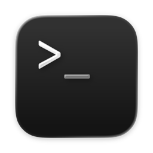
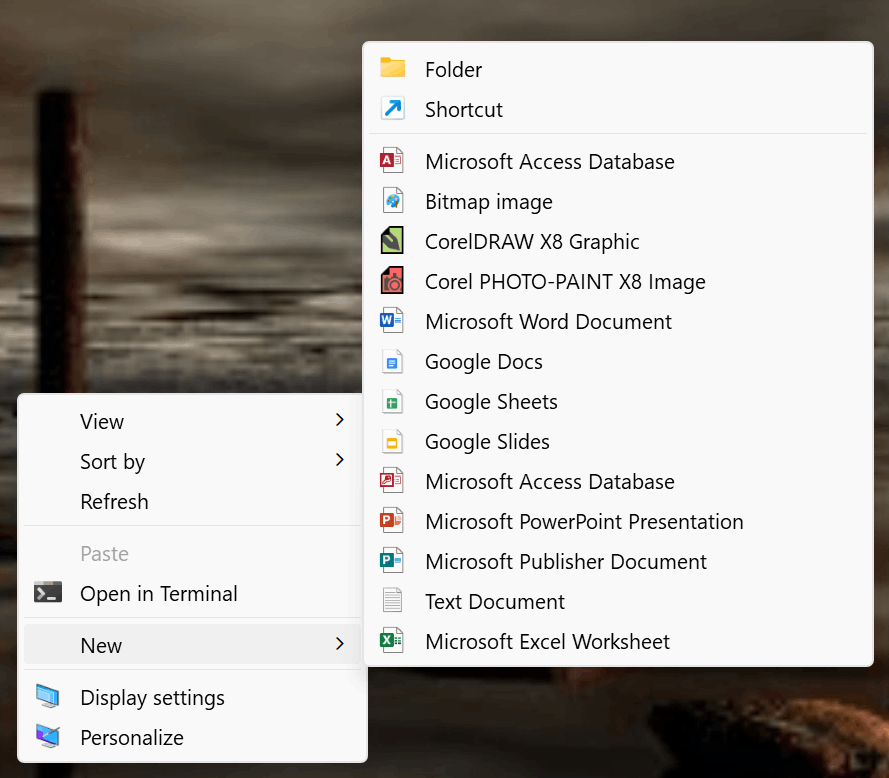
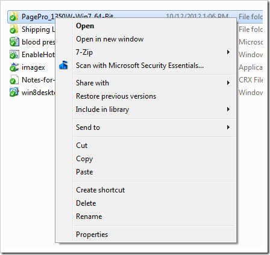
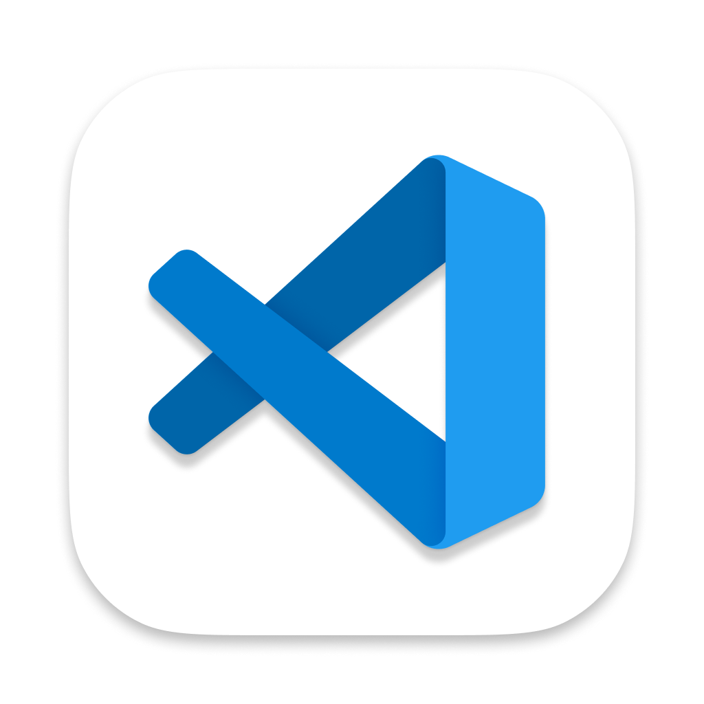
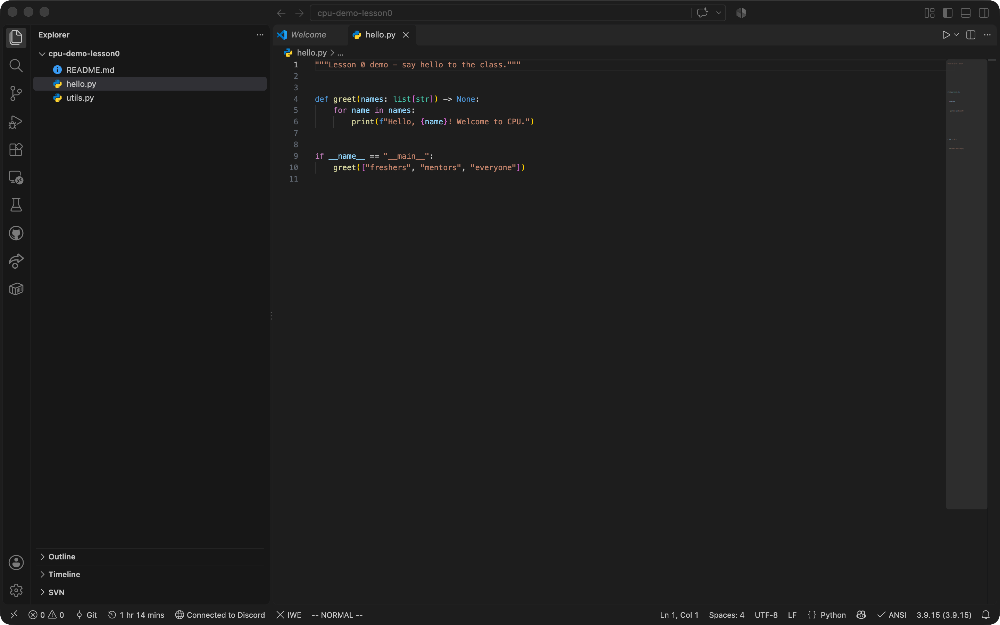
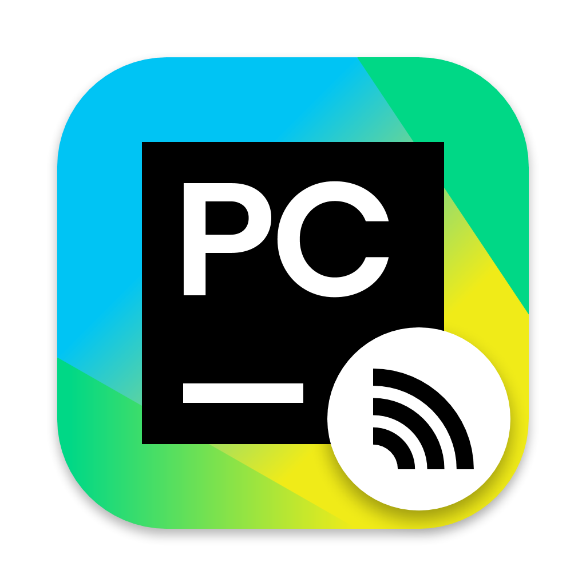
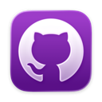

<!--
   CPU · Lesson 0 · Session 04 — How do I build things?
   VS Code + Terminal + Git/GitHub for CS freshmen.
   Order: the need -> terminal -> VS Code -> Git/GitHub -> Markdown.
   Every tool section opens with a scene page (quote + keyword beats) before teaching.
   Slides carry keywords only; the HTML comment on each page is the talk track.
-->

<!-- _class: lead -->
<!-- Cover: title in the yellow band, subtitle, then who and when. -->

# How do I build things?

## VS Code · Terminal · Git & GitHub — your first toolchain

Lesson 0 · Session 04 — CPU Tech Group

5 October 2026

### LESSON 0

#### TOOLCHAINS

---

<!-- _class: agenda -->
<!-- Agenda: six stops, first row highlighted. -->

## The plan for today

1. The need - *week one, in five scenes*
2. Terminal - *the fifty-year-old interface*
3. VS Code - *where you write code*
4. Git & GitHub - *keep and share*
5. Markdown & more toolchains - *how it fits together*

---

<!-- _class: yellow -->
<!-- Section divider. -->

## THE NEED

### 01

#### Here comes some TODOs

Lesson 0 · The toolchain — CPU Tech Group

---

<!-- Regular content: five scenarios as a staircase. Enlarged on purpose.
     讲稿：开学第一周的五个场景，一层层递进——写程序、跑起来、交上去、
     组队、读别人的代码。都不是天才问题，是工具和习惯问题。 -->

## 01 · Week one, in five scenes

<style scoped>
section { font-size: 33px; }
section ul li { margin: 16px 0 !important; }
section ul ul li { margin: 10px 0 !important; }
section ul ul li::before {
  width: 13px !important;
  height: 13px !important;
  background: var(--yellow) !important;
}
</style>

- **Write a program** — tip calculator · due Friday
   - **Make it run** — on the grader's machine too
      - **Hand it in** — Moodle zip · later, a Git repo
         - **Team project** — four people · one codebase
            - **Read code** — tutorials → research

---

<!-- _class: yellow -->
<!-- Section divider. -->

## TERMINAL

### 02

#### Where it all began

Lesson 0 · The toolchain — CPU Tech Group

---

<!-- Regular content: the scene that motivates the terminal.
     讲稿：周五要交的作业，spec 里一行小字：代码必须能在实验室服务器上跑。
     你登上去——没有桌面、没有图标，鼠标点哪儿都没反应。
     只有一个黑窗口和一个闪烁的光标，它在等你敲一行字。
     讲完这页闪回 1969：这个黑窗口是从哪来的。 -->

## 02 · The scene — first Friday, 21:47

> **"your code must run on the lab server"** — coursework spec, week 1

- **You log in** — no desktop · no icons
- **One black window** · a blinking cursor
- **The mouse does nothing**
- **It waits for a line from you**

*Where did this thing come from? 1969.*

---

<!-- _class: activities -->
<!-- 讲稿（时间线 1/4 · 1969–1978）：
     1969 年，贝尔实验室。计算机是一整间屋子的 PDP 系列，贵到一整栋楼共用一台。
     工程师排队用一台像打字机的东西跟它说话——电传打字机 teletype（ASR-33）：
     你敲一行，机器在纸上敲一行回给你。Unix 就是在这样的机器上写出来的，
     所以 Unix 的一切从出生起就是"命令"。
     1977/78 年：Bourne shell（真正读你每一行字的程序）登场；
     DEC 的 VT100 把纸换成了屏幕——玻璃终端，"黑窗口"的原形，
     你 Mac 里的 Terminal.app 就是在软件里模拟这台屏幕。 -->

## 02 · Fifty years, one window — 1969–1978

<style scoped>
section.activities { font-size: 30px; }
section.activities h3 { font-size: 34px !important; margin: 20px 0 8px !important; }
section.activities ul li { font-size: 30px; margin: 9px 0 !important; }
section.activities ul li::before { width: 16px; height: 16px; top: 0.6em; }
</style>

### 1969 · THE TELETYPE

- **Teletype** — keyboard + paper
- **One room-sized machine** — many users
- **Unix is born here** — everything is a command

### 1978 · THE GLASS TERMINAL

- **VT100** — paper becomes a screen
- **Shell** — 1977 · the program reading your lines
- **Terminal.app** — this screen, emulated

---

<!-- _class: activities -->
<!-- 讲稿（时间线 2/4 · 1981–1984）：
     1981 年另一条支线汇进来：IBM PC 出厂直接进 DOS 的 C:\> 提示符，
     没有桌面没有图标，开机就是命令行（COMMAND.COM 就是那时的 shell）。
     1984 年 Macintosh 把图形界面带进千家万户，点鼠标赢了大众。 -->

## 02 · Fifty years, one window — 1981–1984

<style scoped>
section.activities { font-size: 30px; }
section.activities h3 { font-size: 34px !important; margin: 20px 0 8px !important; }
section.activities ul li { font-size: 30px; margin: 9px 0 !important; }
section.activities ul li::before { width: 16px; height: 16px; top: 0.6em; }
</style>

### 1981 · THE PC JOINS IN

- **IBM PC + MS-DOS** — boots straight to `C:\>`
- **COMMAND.COM** — the DOS shell

### 1984 · GUI ARRIVES

- **Macintosh** — windows · icons · mouse
- **Point-and-click wins the home**

---

<!-- _class: activities -->
<!-- 讲稿（时间线 3/4 · 1985–2006）：
     1985 年微软回应：Windows 1.0 只是在 DOS 外面套了一层图形壳——
     黑窗口从没消失，只是藏到了界面底下，今天 Win+R 输入 cmd 就能叫出它
     （cmd.exe 就是当年 COMMAND.COM 的后代）。
     2006 年 PowerShell：不再只会处理文本，还能处理对象，运维工程师的挚爱。 -->

## 02 · Fifty years, one window — 1985–2006

<style scoped>
section.activities { font-size: 30px; }
section.activities h3 { font-size: 34px !important; margin: 20px 0 8px !important; }
section.activities ul li { font-size: 30px; margin: 9px 0 !important; }
section.activities ul li::before { width: 16px; height: 16px; top: 0.6em; }
</style>

### 1985 · WINDOWS ON TOP

- **Windows 1.0** — a GUI riding on DOS
- **The prompt never left** — one `cmd` away

### 2006 · POWERSHELL

- **Objects, not just text**
- **Scriptable everything** — the admin's favourite

---

<!-- _class: activities -->
<!-- 讲稿（时间线 4/4 · 2016–今天，收尾）：
     2016 年 WSL——Windows 里跑真正的 Ubuntu 和 bash；
     2019 年 Windows Terminal 带来标签页和主题。
     但注意：图形界面赢了大众，机房依然没有屏幕、凌晨三点的脚本不需要鼠标、
     SSH 连到千里外的服务器只有文字。
     所以无论 Mac 还是 Windows，你今天敲的 ls，和 1969 年工程师敲的是同一个词。 -->

## 02 · Fifty years, one window — 2016–today

<style scoped>
section.activities { font-size: 30px; }
section.activities h3 { font-size: 34px !important; margin: 20px 0 8px !important; }
section.activities ul li { font-size: 30px; margin: 9px 0 !important; }
section.activities ul li::before { width: 16px; height: 16px; top: 0.6em; }
</style>

### 2016–19 · MODERN WINDOWS SHELL

- **WSL** — virtual Ubuntu · real `bash` inside Windows
- **Windows Terminal** — tabs · themes

### TODAY

- **Never left** — servers · scripts · supercomputers
- **Your laptop ships them** — Terminal / PowerShell app · VS Code too

---

<!-- Regular content: two definitions, then why typing survives. -->

## 02 · The black window, in two words

- **Terminal** — the window
- **Shell** — the program inside · zsh · bash · PowerShell
- **Every button is a command** underneath
- **You own several already** — macOS · Windows · VS Code (`` Ctrl + ` ``)
- **Why type?** — chains · scripts · no screen needed

<style scoped>
section {
  padding-right: 476px;
}
section ul li {
  margin: 6px 0 !important;
}
.side-shot {
  position: absolute;
  top: 0;
  right: -200px;
  width: 640px;
  height: 720px;
}
.side-shot img {
  width: 100%;
  height: 100%;
  object-fit: contain;
  display: block;
}
</style>

<div class="side-shot">
  
</div>

---

<!-- Regular content: the right-click menu, reinterpreted. Keywords only.
     讲稿：从你们最熟悉的右键菜单说起——新建、复制、重命名、删除，闭着眼都会点。
     但每个按钮底下，跑的都是一条命令：图形界面 1984 年才来，命令 1969 年就在了。
     菜单是命令的皮肤。接下来五页，把这份菜单翻译回命令。 -->

## 02 · You might be familiar with these

<style scoped>
section {
  padding-right: 676px;
}
.menu-shot {
  position: absolute;
  top: 0;
  right: 0;
  width: 640px;
  height: 720px;
}
.menu-shot img {
  width: 100%;
  height: 100%;
  object-fit: contain;
  display: block;
}
</style>

> **Open Finder / File Explorer**,
> **Right-click**
> ⬇️
> **New**
> ⬇️
> **Folder**
>
> ---
>
> **Copy · Cut (Move) · Delete**

<div class="menu-shot">
  
</div>

---

<!-- Regular content: look around. 讲稿：双击打开文件夹看看有什么——ls；
     双击进去、退出来——cd。两个地址记住：点 = 这里，点点 = 上一级。 -->

## 02 · Look inside — ls · cd

- **Open a folder, look** — `ls`
- **Double-click in** — `cd folder`
- **Back out** — `cd ..`
- **`.` = here · `..` = one level up**

*macOS · Linux: identical.*

---

<!-- Regular content: create. Image: real mkdir/touch session on the right.
     讲稿：右键新建文件夹，就是 mkdir；新建文本文档，就是 touch——touch 只做一件事，
     放一个零字节的空文件。右边这张实录：mkdir hello，ls 看见它；
     touch a.txt，再 ls，两个都在。命令行里"验证"就是再敲一次 ls。 -->

## 02 · New — mkdir · touch

<style scoped>
.cmd-row {
  display: flex;
  gap: 36px;
  align-items: flex-start;
  margin-top: 8px;
}
.cmd-row ul {
  flex: 1;
  margin-top: 10px;
}
.shot {
  flex: none;
  text-align: center;
}
.shot img {
  width: 380px;
  display: block;
  border: 3px solid #111111;
}
.shot span {
  display: block;
  font-size: 16px;
  font-weight: 700;
  color: #a3a3a3;
  margin-top: 8px;
}
</style>

<div class="cmd-row">
  <ul>
    <li><strong>New → Folder</strong> — <code>mkdir hello</code></li>
    <li><strong>New → Text Document</strong> — <code>touch a.txt</code></li>
    <li><strong>touch makes one thing</strong> — an empty file</li>
    <li><strong>Check it worked</strong> — <code>ls</code> again</li>
  </ul>
  <div class="shot">
    
    <span>a real session — mkdir · touch · ls</span>
  </div>
</div>

---

<!-- Regular content: copy and rename. Image: the ls/cp/mv/rm session.
     讲稿：复制粘贴就是 cp；重命名就是 mv——mv 同时也是移动：给路径就是搬走，给新名字就是改名。
     右边实录：cp a.txt b.txt，mv b.txt c.txt。图里最后一行 rm，留给下一页。 -->

## 02 · Copy, rename — cp · mv

<style scoped>
.cmd-row {
  display: flex;
  gap: 36px;
  align-items: flex-start;
  margin-top: 8px;
}
.cmd-row ul {
  flex: 1;
  margin-top: 10px;
}
.shot {
  flex: none;
  text-align: center;
}
.shot img {
  width: 350px;
  display: block;
  border: 3px solid #111111;
}
.shot span {
  display: block;
  font-size: 16px;
  font-weight: 700;
  color: #a3a3a3;
  margin-top: 8px;
}
</style>

<div class="cmd-row">
  <ul>
    <li><strong>Copy &amp; Paste</strong> — <code>cp a.txt b.txt</code></li>
    <li><strong>Rename</strong> — <code>mv b.txt c.txt</code></li>
    <li><strong>Same command moves</strong> — <code>mv c.txt archive/</code></li>
    <li><strong>New name = rename · path = move</strong></li>
  </ul>
  <div class="shot">
    
    <span>a real session — cp makes a copy, mv renames it</span>
  </div>
</div>

---

<!-- Regular content: delete. 讲稿：删除就是 rm。回看上一页图：最后 rm c.txt，
     再 ls，c.txt 消失了。唯一要敬畏的命令：没有回收站，没有撤销。
     整个文件夹 rm -r project。 freshmen 的第一课：rm 之前先 ls。 -->

## 02 · Delete — rm

- **Delete** — `rm c.txt` — gone
- **No Recycle Bin** — no undo, no second chance
- **Whole folders** — `rm -r project`
- **Last line of the picture** — `ls` again: c.txt is gone

*The one command to respect: `ls` before `rm`.*

---

<!-- Regular content: payoff — the five commands composed into one line. -->

## 02 · One line, one new project

```bash
mkdir my-first-project && cd my-first-project && code .
```

- **Folder → in → open** — zero mouse
- **`.`** — "here"
- **`&&`** — next runs only if the last succeeded
- **The line grows** — `git init` · `git push` soon

---

<!-- Regular content (extension): where terminals will find you this year. -->

## 02 · Where it will find you

- **Installing** — `pip install` · `brew install` · `winget install`
- **Autograders** — coursework runs from one
- **SSH** — lab servers · cloud VMs · no GUI
- **Automation** — 3am, nobody clicking

---

<!-- _class: yellow -->
<!-- Section divider. -->

## VS CODE

### 03

#### Where the code gets written

Lesson 0 · The toolchain — CPU Tech Group

---

<!-- Regular content: the scene that motivates a real editor.
     讲稿：周二晚上 23:40，第一个 Python 作业。
     记事本里写 hello.py，满屏灰色，括号配不配对全靠自己眼睛；
     第 40 行一个拼写错误，找了半个小时；
     有同学用 Word 写代码，引号被自动换成弯引号，Python 当场报错。
     代码需要的不是打字机，是一个懂代码的工作台。 -->

## 03 · The scene — Tuesday, 23:40

> **"implement a tip calculator in Python"** — due Friday

- **hello.py in Notepad** — all grey · no colours
- **A typo at line 40** — half an hour gone
- **Word curls your quotes** — Python explodes
- **No help is coming**

*Code needs a workshop — not a typewriter.*

---

<!-- Regular content: what VS Code is. Icon bottom-right. -->

## 03 · Your workshop for four years

- **Not Word** — code needs a code editor
- **Free · everywhere · huge** — the world's default
- **Bare on purpose** — brains arrive as extensions
- **Today** — install → window → Python → done

<style scoped>
section {
  padding-right: 676px;
}
.side-shot {
  position: absolute;
  top: 0;
  right: 0;
  width: 640px;
  height: 720px;
}
.side-shot img {
  width: 100%;
  height: 100%;
  object-fit: contain;
  display: block;
}
</style>

<div class="side-shot">
  
</div>

---

<!-- Regular content: real VS Code screenshot with numbered overlays and a legend.
     Panel is deliberately legend-only — it is hidden until Ctrl+`. -->

## 03 · One window, five areas

<style scoped>
.shot-row {
  display: flex;
  gap: 30px;
  align-items: flex-start;
  margin-top: 6px;
}
.shot-wrap {
  position: relative;
  width: 760px;
  flex: none;
}
.shot-wrap img {
  width: 100%;
  display: block;
  /* border: 3px solid #111111; */
}
.chip {
  position: absolute;
  transform: translate(-50%, -50%);
  width: 38px;
  height: 38px;
  border-radius: 50%;
  background: #f7d447;
  border: 3px solid #111111;
  color: #111111;
  font-weight: 900;
  font-size: 19px;
  display: flex;
  align-items: center;
  justify-content: center;
}
.chip.c1 { left: 2.5%; top: 56%; }
.chip.c2 { left: 13%; top: 38%; }
.chip.c3 { left: 62%; top: 30%; }
.chip.c4 { left: 47%; top: 96%; }
.legend {
  flex: 1;
  height: 475px;
  display: flex;
  flex-direction: column;
  justify-content: space-evenly;
}
.lrow {
  display: flex;
  align-items: baseline;
  gap: 12px;
  margin: 15px 0;
  font-size: 19px;
  line-height: 1.4;
}
.lrow .num {
  flex: none;
  width: 30px;
  height: 30px;
  border-radius: 50%;
  background: #f7d447;
  border: 2.5px solid #111111;
  font-weight: 900;
  font-size: 15px;
  display: flex;
  align-items: center;
  justify-content: center;
  align-self: center;
}
.lrow strong {
  display: block;
  font-size: 20px;
}
.lrow span {
  display: block;
  color: #a3a3a3;
  font-size: 16px;
}
</style>

<div class="shot-row">
  <div class="shot-wrap">
    
    <div class="chip c1">1</div>
    <div class="chip c2">2</div>
    <div class="chip c3">3</div>
    <div class="chip c4">4</div>
  </div>
  <div class="legend">
    <div class="lrow"><div class="num">1</div><div><strong>Activity Bar</strong><span>files · search · git · extensions</span></div></div>
    <div class="lrow"><div class="num">2</div><div><strong>Explorer</strong><span>your project's files</span></div></div>
    <div class="lrow"><div class="num">3</div><div><strong>Editor</strong><span>tabs · code · minimap</span></div></div>
    <div class="lrow"><div class="num">4</div><div><strong>Status Bar</strong><span>branch · Ln/Col · language</span></div></div>
    <div class="lrow"><div class="num">5</div><div><strong>Panel</strong><span>terminal — Ctrl+` to open</span></div></div>
  </div>
</div>

*Same five areas — first day to final project.*

---

<!-- Regular content: language support in three steps, Python first. -->

## 03 · Teaching the editor your language

- **Out of the box** — colour only
- **Step 1 — add the language** — Python extension
- **Step 2 — pick the interpreter** — the status-bar picker
- **Step 3 — Run** — output in the panel below
- **Same pattern forever** — C/C++ · Java · Rust

---

<!-- Regular content: a short, opinionated extension list. -->

## 03 · Extensions worth installing today

| Extension | Why |
| --- | --- |
| **Python** — Microsoft | run · debug · autocomplete |
| **C/C++** — Microsoft | the spring C courses |
| **Prettier** | one format for the team |
| **GitLens** | who changed this line |
| **Chinese (Simplified) Language Pack** | menus in Chinese |

*Ctrl+Shift+X · all free · can't say why? Uninstall.*

---

<!-- Regular content: the two shortcuts that unlock everything else. -->

## 03 · Two shortcuts and one habit

- **Ctrl/Cmd + Shift + P** — Command Palette — every command
- **Ctrl/Cmd + P** — Quick Open — any file
- **Auto Save: afterDelay** — crashes stop eating homework

*Twice with the mouse this week? It has a shortcut.*

---

<!-- Regular content (extension): other editors exist; depth beats switching. -->

## 03 · Beyond VS Code

- **JetBrains** — PyCharm · IntelliJ · CLion — student licences
- **Vim** — on every server you'll ever meet
- **Cursor** — AI-first · VS Code base
- **Pick one — go deep**

<style scoped>
section {
  padding-right: 676px;
}
.side-shot {
  position: absolute;
  top: 0;
  right: 0;
  width: 640px;
  height: 720px;
}
.side-shot img {
  width: 100%;
  height: 100%;
  object-fit: contain;
  display: block;
}
</style>

<div class="side-shot">
  
</div>

---

<!-- _class: yellow -->
<!-- Live demo A: VS Code. -->

## LIVE DEMO

### A

#### A folder, a file, and a run

VS Code — open a folder, write hello.py, run it, meet the built-in terminal

---

<!-- _class: yellow -->
<!-- Section divider. -->

## GIT & GITHUB

### 04

#### Keep everything, share everything

Lesson 0 · The toolchain — CPU Tech Group

---

<!-- Regular content: the Git/GitHub scene — the filename horror everyone knows.
     讲稿：期末论文的文件名进化史，全场都经历过；代码也是一样，
     直到有人发明了"存档点"。这页笑点之后进 Git。 -->

## 04 · The scene — a filename horror story

```text
essay.docx  ->  essay_v2.docx  ->  essay_final.docx  ->  essay_final_REAL.docx
```

- **Git** — save points for a folder
- **GitHub** — the cloud home for Git folders
- **Three names** — Git the tool · GitHub the site · Desktop the driver
- **Coming for you** — team coursework · internships · research

---

<!-- Regular content: the mental model as a diagram. -->

## 04 · The loop, in one picture

<style scoped>
.loop {
  display: flex;
  align-items: stretch;
  gap: 26px;
  margin-top: 30px;
}
.zone {
  border: 2.5px dashed #c9b96c;
  padding: 18px 16px 20px;
}
.zone-tag {
  display: inline-block;
  background: #f7d447;
  font-family: ui-monospace, 'SF Mono', Menlo, monospace;
  font-weight: 700;
  font-size: 15px;
  letter-spacing: 0.06em;
  padding: 2px 10px;
  margin-bottom: 12px;
}
.zone.laptop {
  flex: 1.6;
}
.zone.cloud {
  flex: 1;
  display: flex;
  flex-direction: column;
}
.zone.cloud .box {
  flex: 1;
}
.pair {
  display: flex;
  align-items: center;
  gap: 10px;
}
.box {
  background: #ffffff;
  border: 3px solid #111111;
  padding: 10px 14px;
  flex: 1;
}
.box strong {
  display: block;
  font-size: 21px;
  font-weight: 900;
}
.box span {
  display: block;
  color: #a3a3a3;
  font-size: 16px;
  margin-top: 2px;
}
.arrow {
  flex: none;
  font-family: ui-monospace, 'SF Mono', Menlo, monospace;
  font-weight: 700;
  font-size: 16px;
  white-space: nowrap;
}
.link-col {
  display: flex;
  flex-direction: column;
  justify-content: center;
  gap: 14px;
}
</style>

<div class="loop">
  <div class="zone laptop">
    <div class="zone-tag">YOUR LAPTOP</div>
    <div class="pair">
      <div class="box"><strong>Working folder</strong><span>hello.py — where you edit</span></div>
      <div class="arrow">commit →</div>
      <div class="box"><strong>Local history</strong><span>save points kept by Git</span></div>
    </div>
  </div>
  <div class="link-col">
    <div class="arrow">push →</div>
    <div class="arrow">← pull</div>
  </div>
  <div class="zone cloud">
    <div class="zone-tag">GITHUB — CLOUD COPY</div>
    <div class="box"><strong>Remote repository</strong><span>backup · teammates · the world</span></div>
  </div>
</div>

- **commit** — labelled save point, on your laptop
- **push** — upload your save points
- **pull** — download everyone else's

*edit · commit · push · pull — 90% of Git.*

---

<!-- Regular content: GitHub Desktop walkthrough, button by button. -->

## 04 · GitHub Desktop — the loop, no typing

1. **Clone** — File → Clone repository
2. **Edit in VS Code** — Desktop lists every change
3. **Commit** — tick files · honest message · "Commit to main"
4. **Push origin / Pull origin** — yours up · theirs down

*Hover any button — Desktop shows the git command underneath.*

<style scoped>
.iconstrip {
  display: flex;
  align-items: center;
  justify-content: flex-start;
  gap: 22px;
  margin-top: 26px;
}
.iconstrip .step {
  display: flex;
  align-items: center;
  gap: 14px;
}
.iconstrip img {
  width: 64px;
  height: 64px;
}
.iconstrip span {
  display: block;
  font-size: 16px;
  font-weight: 700;
  line-height: 1.3;
}
.iconstrip span em {
  display: block;
  font-style: normal;
  color: #a3a3a3;
  font-size: 14px;
  font-weight: 500;
}
.iconstrip .join {
  font-family: ui-monospace, 'SF Mono', Menlo, monospace;
  font-weight: 700;
  font-size: 22px;
  color: #a3a3a3;
}
</style>

<div class="iconstrip">
  <div class="step">
    
    <span>write<em>your laptop</em></span>
  </div>
  <div class="join">→</div>
  <div class="step">
    
    <span>commit · push<em>GitHub Desktop</em></span>
  </div>
  <div class="join">→</div>
  <div class="step">
    
    <span>see it online<em>github.com</em></span>
  </div>
</div>

---

<!-- Regular content (extension): branches as parallel timelines. -->

## 04 · Branches — parallel timelines

- **Branch** — a parallel timeline
- **main stays runnable**
- **Try → merge or delete**
- **Teams** — own branch each · merge by pull request
- **In Desktop** — one dropdown: new · switch · merge · publish

*Not week one. Week ten — file this page.*

---

<!-- Regular content (extension): GitHub beyond being a backup. -->

## 04 · More than a backup

- **Public workshop** — a profile beats a CV line
- **Open source** — issues · pull requests · reviews
- **Coursework & research** — team repos · reproducible code
- **Every repo opens on its README** — next section

---

<!-- _class: yellow -->
<!-- Live demo B: GitHub Desktop round trip. -->

## LIVE DEMO

### B

#### Edit to GitHub in four clicks

GitHub Desktop — clone, change, commit, push, then refresh the page and watch it land

---

<!-- _class: yellow -->
<!-- Section divider. -->

## TOOLCHAIN

### 05

#### Markdown, and how it all fits

Lesson 0 · The toolchain — CPU Tech Group

---

<!-- Regular content: the scene that motivates Markdown.
     讲稿：凌晨一点，你随手点开 GitHub 上一个陌生的仓库。
     迎接你的是一个文件：README.md。
     明明是纯文本，却有标题、列表、代码块、链接——
     没用 Word，没有工具栏，只有字符在排版。
     这门"用字符排版"的语言就是 Markdown。 -->

## 05 · The scene — a repo at 1am

> **you open a stranger's repo** — curious, 1am

- **One file greets you** — README.md
- **Plain text** — yet headings · lists · code · links
- **No Word** · no toolbar · no formatting painter
- **Just characters, doing layout**

*That language is Markdown — next.*

---

<!-- Regular content: Markdown source next to its rendered look. -->

## 05 · Markdown — write once, read anywhere

<style scoped>
.md-cols {
  display: flex;
  gap: 26px;
  margin-top: 10px;
}
.md-col {
  flex: 1;
}
.md-col .tag {
  display: inline-block;
  background: #f7d447;
  font-family: ui-monospace, 'SF Mono', Menlo, monospace;
  font-weight: 700;
  font-size: 15px;
  letter-spacing: 0.06em;
  padding: 2px 10px;
  margin-bottom: 10px;
}
.md-col pre {
  margin: 0;
  background: #f6f1de;
  border: 2.5px solid #111111;
  padding: 14px 18px;
  font-family: ui-monospace, 'SF Mono', Menlo, monospace;
  font-size: 17px;
  line-height: 1.5;
  white-space: pre-wrap;
}
.rendered {
  background: #ffffff;
  border: 2.5px solid #111111;
  padding: 12px 18px 10px;
  min-height: 176px;
}
.rendered .h1 {
  font-weight: 900;
  font-size: 26px;
  line-height: 1.2;
}
.rendered .h2 {
  font-weight: 900;
  font-size: 21px;
  margin-top: 6px;
}
.rendered ul {
  margin: 6px 0;
}
.rendered li {
  margin: 4px 0;
  font-size: 19px;
}
.rendered .lnk {
  color: #7a7a7a;
  text-decoration: underline;
  font-size: 18px;
}
</style>

<div class="md-cols">
  <div class="md-col">
    <div class="tag">YOU TYPE</div>
    <pre># My project
## Setup
- install **Python 3.12**
- run `python hello.py`
- see [the docs](https://...)</pre>
  </div>
  <div class="md-col">
    <div class="tag">READERS SEE</div>
    <div class="rendered">
      <div class="h1">My project</div>
      <div class="h2">Setup</div>
      <ul>
        <li>install <strong>Python 3.12</strong></li>
        <li>run <code>python hello.py</code></li>
        <li>see <span class="lnk">the docs</span></li>
      </ul>
    </div>
  </div>
</div>

- **Plain text, lightly formatted** — readable raw · pretty rendered
- **Everywhere** — GitHub · Jupyter · notes apps
- **This deck** — Markdown, rendered by Marp

---

<!-- Regular content: the toolchain map — four tool cards plus what comes later. -->

## 05 · The toolchain so far

<style scoped>
.chain {
  display: flex;
  align-items: stretch;
  gap: 18px;
  margin-top: 16px;
}
.card {
  flex: 1;
  border: 3px solid #111111;
  padding: 16px 14px 12px;
  text-align: center;
  background: #ffffff;
}
.card img {
  width: 66px;
  height: 66px;
  display: block;
  margin: 0 auto 8px;
}
.card .glyph {
  font-family: 'Archivo Black', 'Arial Black', sans-serif;
  font-size: 52px;
  line-height: 66px;
  height: 66px;
  margin-bottom: 8px;
  color: #111111;
}
.card .verb {
  background: #f7d447;
  display: inline-block;
  font-weight: 900;
  font-size: 17px;
  letter-spacing: 0.08em;
  padding: 1px 10px;
}
.card .name {
  font-weight: 900;
  font-size: 21px;
  margin-top: 8px;
}
.card .what {
  color: #a3a3a3;
  font-size: 15.5px;
  line-height: 1.35;
  margin-top: 4px;
}
.later {
  display: flex;
  align-items: center;
  gap: 16px;
  margin-top: 22px;
  border: 2.5px dashed #c9b96c;
  padding: 8px 18px;
}
.later img {
  width: 44px;
  height: 44px;
}
.later .txt {
  font-family: ui-monospace, 'SF Mono', Menlo, monospace;
  font-weight: 700;
  font-size: 18px;
  letter-spacing: 0.04em;
  color: #7a7a7a;
}
</style>

<div class="chain">
  <div class="card">
    
    <div class="verb">RUN</div>
    <div class="name">Terminal</div>
    <div class="what">run · install · automate</div>
  </div>
  <div class="card">
    
    <div class="verb">WRITE</div>
    <div class="name">VS Code</div>
    <div class="what">code · autocomplete · extensions</div>
  </div>
  <div class="card">
    
    <div class="verb">VERSION</div>
    <div class="name">Git + GitHub</div>
    <div class="what">save points · shared in the cloud</div>
  </div>
  <div class="card">
    <div class="glyph">#</div>
    <div class="verb">DOCUMENT</div>
    <div class="name">Markdown</div>
    <div class="what">READMEs · reports · this deck</div>
  </div>
</div>

<div class="later">
  
  <div class="txt">LATER THIS SERIES — SSH · DOCKER · CI · AI IN THE TERMINAL</div>
</div>

*One job each — together, a workshop.*

---

<!-- Regular content: where to learn more. -->

## Where to learn more

- **code.visualstudio.com/docs** — VS Code docs
- **git-scm.com/book** — Pro Git · chapters 1–3
- **desktop.github.com** — Desktop guides
- **markdownguide.org** — the cheat sheet
- **github.com/CompPsyUnion** — last year's notes

*Stuck? Group chat · any mentor.*

---

<!-- _class: yellow -->
<!-- Closing. -->

## THANK YOU

### 04

#### How do I build things?

Lesson 0 · The toolchain — CPU Tech Group · 5 October 2026
